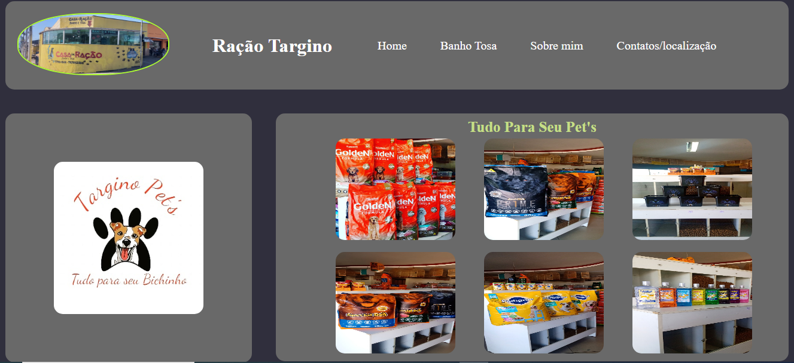

<h1 align="center"> Projeto Auri Targino </h1>

Bom !! uma página bem simples web, aqui tendei o máximo
desenvolver a tecnica de posições de caixas esquerda, direita etc... não é responsiva, mas... pretendo desenvolver o mesmo modelo responsivo, o importante é isso, tentar não desistir,
claro... estudando.
 

  <a href="#-tecnologias">Tecnologias</a>&nbsp;&nbsp;&nbsp;|&nbsp;&nbsp;&nbsp;
  <a href="#-projeto">Projeto</a>&nbsp;&nbsp;&nbsp;|&nbsp;&nbsp;&nbsp;
  <a href="#-layout">Layout</a>&nbsp;&nbsp;&nbsp;|&nbsp;&nbsp;&nbsp;
  <a href="#memo-licença">Licença</a>

  

 

  

## 🚀 Tecnologias

Esse projeto foi desenvolvido com as seguintes tecnologias:

- HTML e CSS
- Git e Github
- Readme
## 💻 Projeto

Aqui trabalhei com posições das caixas, alinhamento etc....
não é um projeto responsivo, mas... vou trabalhar em um
do mesmo modelo  responsivo. 

## :memo: Licença

Esse projeto está sob a licença MIT.
---
Feito com ♥ por  Auri Targino : ( https://auritargino.github.io/PaginaWebPets/)